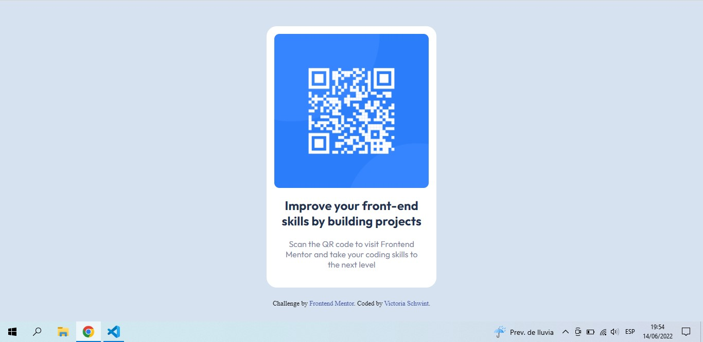
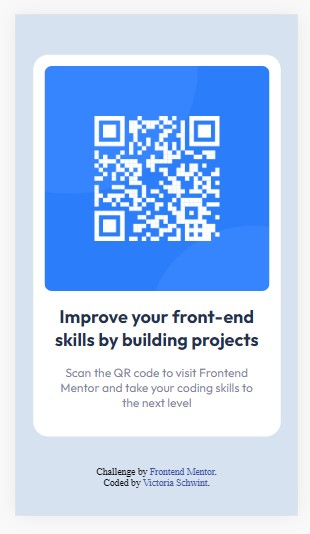

# Frontend Mentor - QR code component solution

This is a solution to the [QR code component challenge on Frontend Mentor](https://www.frontendmentor.io/challenges/qr-code-component-iux_sIO_H). Frontend Mentor challenges help you improve your coding skills by building realistic projects. 

## Table of contents

- [Screenshot](#screenshot)
- [Links](#links)
- [Built with](#built-with)
- [What I learned](#what-i-learned)
- [Continued development](#continued-development)
- [Useful resources](#useful-resources)
- [Author](#author)

### Screenshot

### Links

- Solution URL: (https://github.com/victoriaschwin/Frontend-Mentor-Project.git)

### Built with

- Semantic HTML5 markup
- CSS custom properties
- Flexbox

### What I learned

During this project the major challenge was to do a responsive design. 
I used flexbox and try to use viewheight and rem instead of pixels. 
I had some difficulties to align the text with the image of the QR. At the end, to get the text to break at the same words
that the example I end up using ' '. I think there is a better way of doing it with the margins of the 'title' and 'description' divs but I wasn´t able to do it.
The last challenge was setting the footer and the bottom center of the page in all different media querys wich I'm really 
proud of myself.

``
.attribution { 
    position: fixed;
    left: 50%;
    bottom: 20px;
    transform: translate(-50%, -50%);
    margin: 0 auto;
    font-size: 0.8rem; 
    text-align:center; 
    
}
``
### Continued development

In future projects I want to focus on doing a mobile first design and getting more comfortable in using flexbox.

### Useful resources

- (https://css-tricks.com/snippets/css/a-guide-to-flexbox/) - This helped me with flexbox and all it's properties. A really usefull guide to have at hand.

## Author

- Website - [Victoria Schwint](https://www.your-site.com)
- Frontend Mentor - [@yourusername](https://www.frontendmentor.io/profile/yourusername)
